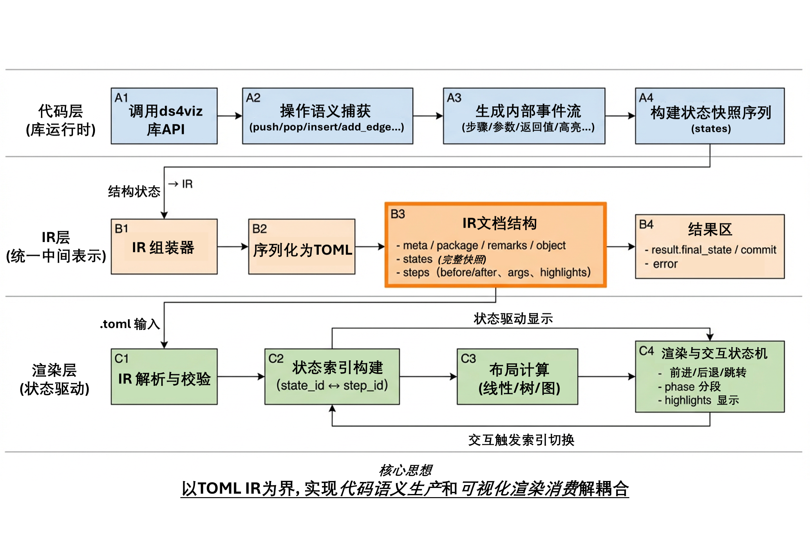
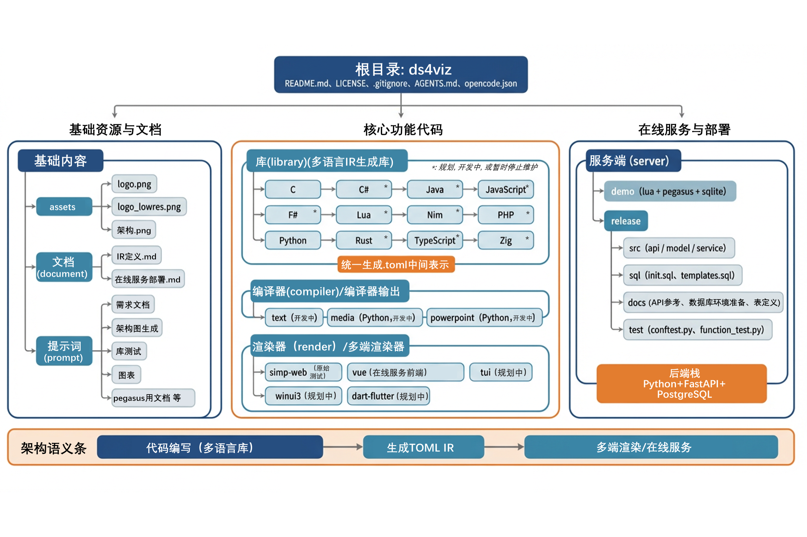

# `ds4viz`

`WaterRun`  

  

毕业设计项目. 一个可扩展的数据结构可视化教学平台.  

`ds4viz` -> `datastructure for visualizaion` -> `数据结构可视化`.  

***界面效果示例:*** [效果示例](效果示例.md)  
***AI接盘快速二开:*** [二开快速上手](document/二开快速上手.md)  

## 快速拉起项目  

最省心方案是 Docker; 如果机器装不了 Docker, 走本地方案.

### 方式 A: Docker(推荐)

**先装环境**

- Docker Desktop: <https://www.docker.com/products/docker-desktop/>
- Docker Engine(Linux): <https://docs.docker.com/engine/install/>

**启动**

```bash
cp docker/.env.example .env
./docker/manage.sh up
```

启动后访问 `http://localhost:5173`.

### 方式 B: 本地开发(无 Docker)

**环境下载**

- Git: <https://git-scm.com/downloads>
- Python 3.12+: <https://www.python.org/downloads/>
- Node.js 22 LTS 或 20 LTS: <https://nodejs.org/>
- pnpm: <https://pnpm.io/installation>
- PostgreSQL 18+: <https://www.postgresql.org/download/>
- GCC/Clang(C17+):
  - Windows(MinGW-w64): <https://www.mingw-w64.org/downloads/>
  - macOS(Xcode Command Line Tools): <https://developer.apple.com/downloads/>
  - Linux(发行版包管理器)

**启动步骤(顺序执行)**

```bash
# 1) 后端
cd server/release
pip install bcrypt pyjwt psycopg[pool] pyyaml fastapi uvicorn python-multipart
python src/main.py --test

# 2) 前端
cd ../../render/vue
pnpm install
pnpm dev
```

前端访问 `http://localhost:5173`, 后端文档 `http://localhost:10000/docs`.

> PostgreSQL 初始化与更多细节见 [`server/release/README.md`](./server/release/README.md).

## 不那么有趣的内容  

### 核心架构

采用"代码 → 中间语言 → 渲染"三层解耦架构:

```plaintext
[编写代码]              [执行生成]                [可视化渲染]
调用ds4viz库  ->  生成统一.toml描述文件  ->  渲染器解析并交互展示
```


**关键特性**  

* **语言无关**: 通过`.toml`作为统一中间表示(IR), 支持任意语言扩展
* **渲染无关**: 同一份`.toml`可在Web/CLI/桌面/移动端多平台渲染
* **教学友好**: 参考[algorithm-visualizer](https://github.com/algorithm-visualizer/algorithm-visualizer)设计, 代码即文档, 统一且易上手



### 支持结构  

* **全局配置**

  * `config`（输出路径、标题、作者、注释）

* **线性结构**

  * `stack`（栈）
  * `queue`（队列）
  * `single_linked_list`（单链表）
  * `double_linked_list`（双向链表）

* **树结构**

  * `binary_tree`（二叉树）
  * `binary_search_tree`（二叉搜索树）

* **图结构**

  * `graph_undirected`（无向图）
  * `graph_directed`（有向图）
  * `graph_weighted`（带权图：`directed=False` 无向 / `directed=True` 有向）

### `.toml` IR生成库

按语言实现ds4viz库, 运行时生成标准化的`.toml`中间文件.

### 库设计原则

* 代码即文档: API简洁一致, 无需额外学习成本
* 上下文管理: 自动捕获执行流程, 确保成功/失败均生成有效`.toml`
* 语义统一: 不同语言库生成的`.toml`结构完全一致

### 当前支持的语言

| 语言     | 安装                                                                                    | 文档                                | 状态   |
|----------|-----------------------------------------------------------------------------------------|-------------------------------------|--------|
| `Python` | `pip install ds4viz`                                                                    | [py-ds4viz](./library/python/README.md) | 已就绪 |
| `C`      | 前往[Release](https://github.com/Water-Run/ds4viz/releases/tag/lib-0.1.0)下载`ds4viz.h` | [c-ds4viz](./library/c/README.md)       | 已就绪 |

> 早期/未完成/暂停支持的语言实现已归档至 [`.archived/libraries/`](./.archived/libraries/README.md). 

### 渲染器

解析`.toml`IR并生成交互式可视化界面, 支持多平台部署.  
包括使用提供的在线服务和本地的集成编码-渲染环境.

| 渲染器 | 平台                | 下载 | 文档                            | 状态   |
|--------|---------------------|------|---------------------------------|--------|
| `vue`  | Web (SPA, 在线服务) | -    | [Vue渲染器](./render/vue/README.md) | 已完成 |

> 旧版 demo 渲染器(`simp-web`)及未实现的渲染器(`tui`/`winui3`/`flutter`)已归档至 [`.archived/renderers/`](./.archived/renderers/README.md).

### 在线服务(Vue Web)

提供在线代码编辑 + 远程执行 + 实时可视化的一站式体验.

* 左侧编辑器: 支持多语言高亮/补全, 提供预设模板
* 右侧可视化: 实时渲染`.toml`, 支持步进/回退/跳转
* 远程执行: 后端沙箱运行代码, 带超时/资源限制保护
* 直接上传: 也可本地生成`.toml`后直接上传渲染

```plaintext
前端(Vue3+TS) <-> 后端(Python+FastAPI+PostgreSQL)
    |                    |
  编辑器              沙箱执行引擎
  渲染器              TOML验证器
```

通过`systemd-run`瞬态单元做到每次请求对应一次性临时沙箱安全运行.  
另提供登陆及模板系统.

> Vue在线服务后端参见: [后端文档](./server/release/README.md)  

### 文档参考

| 文档                                       |
|--------------------------------------------|
| [IR定义](./document/IR定义.md)             |
| [在线服务部署](./document/在线服务部署.md) |
| [二开快速上手](./document/二开快速上手.md)         |

代码结构布局如下图所示.  



> 未实现 / 旧版 / demo 的子项目(多语言库、渲染器、编译器、demo 服务)已归档至 [`.archived/`](./.archived/README.md), 保留历史供查阅, 不参与当前构建.
