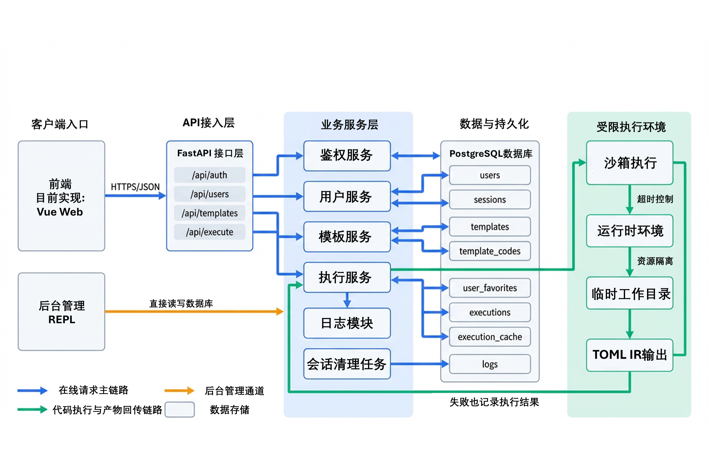

# `ds4viz` 服务系统  

`ds4viz`的在线服务.  
运行于`Fedora 43`.  

## 架构  

```bash
├── docs # 文档
│   ├── 表定义.md
│   └── API参考.md
├── prompts # 提示词
│   ├── 编码规范.md
│   └── 服务系统.md
├── README.md
├── sql
│   └── init.sql # 数据库初始化
├── src
│   ├── api
│   │   ├── auth.py # 鉴权相关
│   │   ├── execution.py # 执行相关
│   │   ├── __init__.py
│   │   ├── template.py # 模板相关
│   │   └── user.py # 用户相关
│   ├── config
│   │   ├── prod.yml # 生产配置
│   │   └── test.yml # 用户配置
│   ├── database.py # 数据库连接
│   ├── exceptions.py # 异常
│   ├── __init__.py
│   ├── log.py # 日志
│   ├── config.py # 配置
│   ├── main.py # 命令行解析和入口
│   ├── model
│   │   ├── execution.py # 执行模型
│   │   ├── __init__.py
│   │   ├── template.py # 模板模型
│   │   └── user.py # 用户模型
│   ├── service
│   │   ├── auth_service.py # 鉴权服务
│   │   ├── execution_service.py # 执行服务
│   │   ├── __init__.py
│   │   ├── sandbox_service.py # 沙箱服务
│   │   ├── template_service.py # 模板服务
│   │   └── user_service.py # 用户服务
│   └── utils.py # 通用的无依赖工具
└── test # 测试
    ├── conftest.py
    ├── function_test.py
    └── stress_test.py
```

  

## 启动  

环境准备:  

```bash
pip install bcrypt pyjwt psycopg[pool] pyyaml fastapi uvicorn python-multipart
```

测试:  

```bash
pytest -v
```

以生产配置启动服务器:  

```bash
python src/main.py --prod
```

以测试配置启动服务器:  

```bash
python src/main.py --test
```

## 管理系统  

独立的REPL, 直接写数据库, 做的简单, 无额外后端接口.  

```bash
cd admin-repl && lua admin-repl.lua # 确保进入正确目录, 避免日志位置错误
```

## 文档  

- [表定义](./docs/表定义.md)  
- [数据库环境准备](./docs/数据库环境准备.md)  
- [API参考](./docs/API参考.md)  
- [管理REPL](./admin-repl/README.md)  
